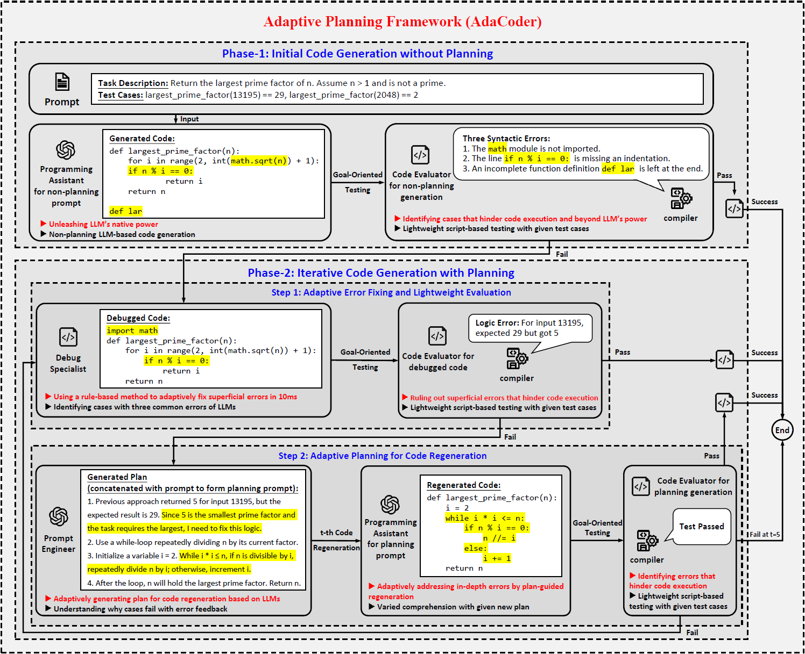

# AdaCoder: Adaptive Planning Framework for Multi-Agent Code Generation

## Overview



AdaCoder is a multi-agent framework that simplifies iterative code generation by combining planning and non-planning mechanisms to achieve better performance while minimizing computational costs. Unlike existing frameworks, AdaCoder fully leverages the planning mechanism only when the non-planning approach fails, ensuring efficient use of resources. The framework consists of four agents: Programming Assistant, Code Evaluator, Debug Specialist, and Prompt Engineer, which collaborate to handle tasks. The process begins with the Programming Assistant generating code based on a task description using the non-planning mechanism. The Code Evaluator then assesses the code's correctness using benchmark-provided sample test cases (e.g., HumanEval). If errors are detected, the Debug Specialist resolves basic issues, and the corrected code is reassessed. If errors persist, indicating flawed logic or a misunderstanding of the task, the Prompt Engineer designs a step-by-step plan to guide the Programming Assistant in regenerating the code using the planning mechanism. This iterative process continues for up to $t$ iterations or until the code passes all tests, with different errors triggering diverse planning prompts in each iteration.

## Installation

1. **Clone the Repository**  
   Begin by cloning the AdaCoder repository to your local machine using the following commands:
   
   ```bash
   git clone https://github.com/YXingo/AdaCoder.git
   cd AdaCoder
   ```
   
2. **Install Dependencies**  
   Install the required Python dependencies by running:
   ```bash
   pip install -r requirements.txt
   ```

3. **Configure Model Settings**  
   - For **closed-source models**, set your `api_key` in the configuration file or environment variables.  
   - For **open-source models**, specify the `model_path` to point to the local model directory.

4. **Run the Project**  
   Once the setup is complete, execute the project with the following command:
   ```bash
   python src/execute.py
   ```

