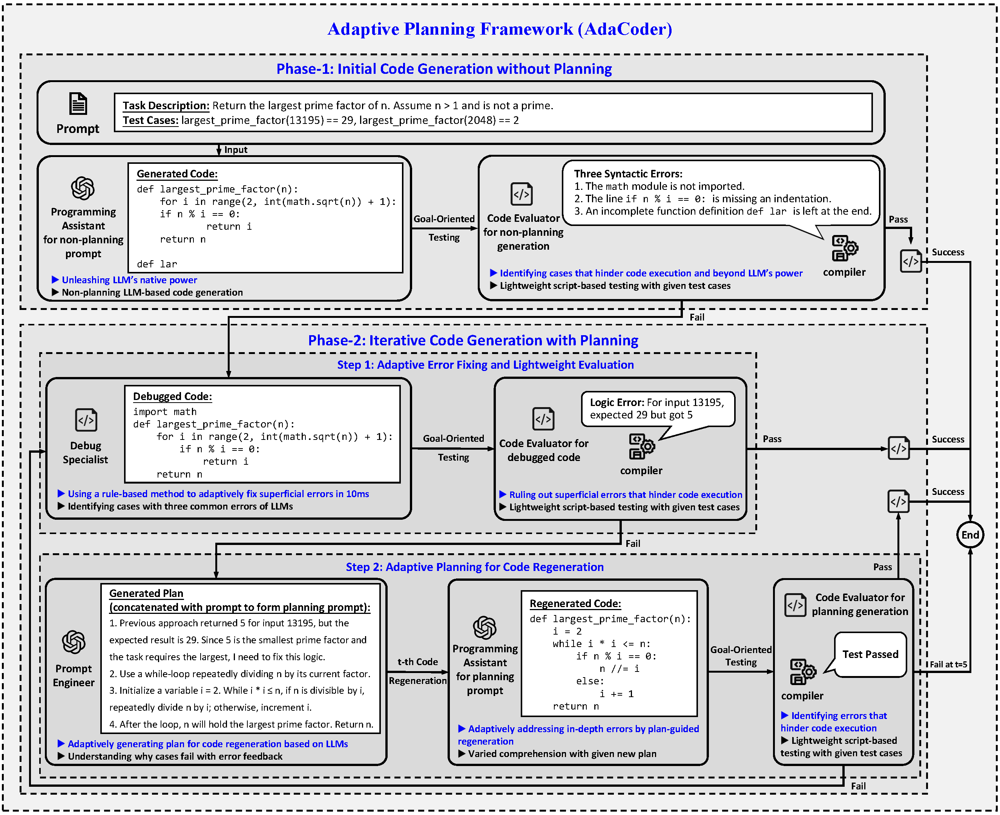

# AdaCoder: An Adaptive Planning and Multi-Agent Framework for Function-Level Code Generation

## Overview



AdaCoder consists of four collaborative agents to generate code: a Programming Assistant, a Code Evaluator, a Debug Specialist, and a Prompt Engineer. The details can be found in Algorithm 1 in Appendix. Figure 5 illustrates the overall workflow of AdaCoder using an example task: finding the largest prime factor of a number $n$. The process includes two phases.

Phase-1 focuses on Initial Code Generation without Planning, aiming to leverage the LLM's native capabilities directly. Initially, the Programming Assistant receives the task description and sample test cases. It then generates the initial code without a plan, as depicted in the top-left of Figure 5. This code may contain superficial errors, which are defined as errors in syntax or structure (like missing imports, incorrect indentation, or incomplete function definitions as shown in the example) that prevent the code from being compiled or run. Consequently, these errors hinder code execution, meaning the program cannot produce an output that can be compared against expected test results. Subsequently, the Code Evaluator performs “Goal-Oriented Testing.” In this phase, its primary goal is specifically to detect these execution-hindering superficial errors within try-except blocks. If no such errors are found and the code passes all tests, the process ends. However, the flawed code and specific error details are passed forward to initiate Phase-2.

Phase-2 involves Iterative Code Generation with Planning and is triggered only upon Phase-1 failure. It consists of two steps, repeated up to $t$ times. First, in Step 1, the Debug Specialist takes the code and error information, applying rule-based fixes for common superficial issues (e.g., adding import math, correcting indentation) to produce syntactically correct code. The Code Evaluator then performs “Goal-Oriented Testing” again, but now with the goal shifted to detecting logic errors (also referred to as in-depth errors). These are defined as flaws in the algorithm’s reasoning or implementation that cause the code to produce incorrect results (i.e., fail test case assertions), even if it runs without crashing. For instance, the debugged code in Figure 5 runs but returns 5 instead of the expected 29, indicating a logic error. If the tests pass, the process ends. If logic errors are detected, the failure feedback proceeds to the next step. In Step 2, the Prompt Engineer uses the original task description and the specific logic error feedback to generate a tailored step-by-step plan to correct the issue (like the while-loop plan in Fig. 5). The Programming Assistant then regenerates the code, guided by this plan. Finally, the Code Evaluator tests this new code. Success leads to termination; failure leads back to the beginning of Phase-2 (Step 1) with the latest error information, iterating until success or the maximum $t$ attempts are reached.

Generally, AdaCoder employs “Adaptive Planning,” which is achieved through two strategies: 1) It only applies the planning mechanism for iterative regeneration when the LLM’s native capability proves insufficient (i.e., the initial non-planning generation fails), rather than using planning for every attempt; 2) During the planning phase, it generates a plan that is adapted to the specific error feedback from the failed regeneration attempt.

## Installation

1. **Clone the Repository**  
   Begin by cloning the AdaCoder repository to your local machine using the following commands:
   
   ```bash
   git clone https://github.com/YXingo/AdaCoder.git
   cd AdaCoder
   ```
   
2. **Install Dependencies**  
   Install the required Python dependencies by running:
   ```bash
   pip install -r requirements.txt
   ```

3. **Configure Model Settings**  
   - For **closed-source models**, set your `api_key` in the configuration file or environment variables.  
   - For **open-source models**, specify the `model_path` to point to the local model directory.

4. **Run the Project**  
   Once the setup is complete, execute the project with the following command:
   ```bash
   python src/execute.py
   ```

## Cases

````json
[
  [
    {
      "Programming_Assistant": {
        "prompt": """## Task Description

```python
def is_palindrome(string: str) -> bool:
    \"\"\" Test if given string is a palindrome \"\"\"
    return string == string[::-1]


def make_palindrome(string: str) -> str:
    \"\"\" Find the shortest palindrome that begins with a supplied string.
    Algorithm idea is simple:
    - Find the longest postfix of supplied string that is a palindrome.
    - Append to the end of the string reverse of a string prefix that comes before the palindromic suffix.
    >>> make_palindrome('')
    ''
    >>> make_palindrome('cat')
    'catac'
    >>> make_palindrome('cata')
    'catac'
    \"\"\"
```
""",
        "code": """def make_palindrome(string: str) -> str:
    \"\"\" Find the shortest palindrome that begins with a supplied string. \"\"\"
    if is_palindrome(string):
        return string
    for i in range(len(string)):
        if is_palindrome(string[i:]):
            return string + string[:i][::-1]
    return ''

# Examples to test"""
      }
    },
    {
      "Code_Evaluator": {
        "passed": false,
        "exception_type": "NameError",
        "exception_message": "name 'is_palindrome' is not defined"
      }
    },
    {
      "Debug_Specialist": {
        "origin_code": """def make_palindrome(string: str) -> str:
    \"\"\" Find the shortest palindrome that begins with a supplied string. \"\"\"
    if is_palindrome(string):
        return string
    for i in range(len(string)):
        if is_palindrome(string[i:]):
            return string + string[:i][::-1]
    return ''

# Examples to test""",
        "debugged_code": """def make_palindrome(string: str) -> str:
    \"\"\" Find the shortest palindrome that begins with a supplied string. \"\"\"
    if is_palindrome(string):
        return string
    for i in range(len(string)):
        if is_palindrome(string[i:]):
            return string + string[:i][::-1]
    return ''

# Examples to test"""
      }
    },
    {
      "Code_Evaluator": {
        "passed": false,
        "exception_type": "NameError",
        "exception_message": "name 'is_palindrome' is not defined"
      }
    },
    {
      "Prompt_Engineer": {
        "prompt": """Develop a new plan based on the feedback from the last error.

## Task Description

```python
def is_palindrome(string: str) -> bool:
    \"\"\" Test if given string is a palindrome \"\"\"
    return string == string[::-1]


def make_palindrome(string: str) -> str:
    \"\"\" Find the shortest palindrome that begins with a supplied string.
    Algorithm idea is simple:
    - Find the longest postfix of supplied string that is a palindrome.
    - Append to the end of the string reverse of a string prefix that comes before the palindromic suffix.
    >>> make_palindrome('')
    ''
    >>> make_palindrome('cat')
    'catac'
    >>> make_palindrome('cata')
    'catac'
    \"\"\"
```

## Error FeedBack

Error Type: "NameError",
Error Message: "name 'is_palindrome' is not defined"

## My Plan
1. Firstly, 
""",
        "plan": """1. Check if the input string is already a palindrome using the `is_palindrome` function.
   - If it is, return the string as it is.

2. Initialize a loop to find the longest palindromic suffix:
   - Start with the entire string and decrementally reduce its size to find the longest suffix that is a palindrome.

3. Iterate backwards over possible suffix lengths, starting with the last character:
   - For each suffix, check if it is a palindrome using the `is_palindrome` function.

4. Identify the longest palindromic suffix:
   - Once found, break the loop with the index where the palindromic suffix starts.

5. Determine the prefix that comes before the palindromic suffix:
   - Store this prefix for future modification.

6. Reverse the prefix determined in the previous step.

7. Append the reversed prefix to the original string to create the shortest palindrome.

8. Return the newly formed palindrome."""
      }
    },
    {
      "Programming_Assistant": {
        "prompt": """Solve the following problem according to the given plan.

## Plan

1. Check if the input string is already a palindrome using the `is_palindrome` function.
   - If it is, return the string as it is.

2. Initialize a loop to find the longest palindromic suffix:
   - Start with the entire string and decrementally reduce its size to find the longest suffix that is a palindrome.

3. Iterate backwards over possible suffix lengths, starting with the last character:
   - For each suffix, check if it is a palindrome using the `is_palindrome` function.

4. Identify the longest palindromic suffix:
   - Once found, break the loop with the index where the palindromic suffix starts.

5. Determine the prefix that comes before the palindromic suffix:
   - Store this prefix for future modification.

6. Reverse the prefix determined in the previous step.

7. Append the reversed prefix to the original string to create the shortest palindrome.

8. Return the newly formed palindrome.

## Task Description

```python
def is_palindrome(string: str) -> bool:
    \"\"\" Test if given string is a palindrome \"\"\"
    return string == string[::-1]


def make_palindrome(string: str) -> str:
    \"\"\" Find the shortest palindrome that begins with a supplied string.
    Algorithm idea is simple:
    - Find the longest postfix of supplied string that is a palindrome.
    - Append to the end of the string reverse of a string prefix that comes before the palindromic suffix.
    >>> make_palindrome('')
    ''
    >>> make_palindrome('cat')
    'catac'
    >>> make_palindrome('cata')
    'catac'
    \"\"\"
```
""",
        "code": """def is_palindrome(string: str) -> bool:
    \"\"\" Test if given string is a palindrome \"\"\"
    return string == string[::-1]

def make_palindrome(string: str) -> str:
    \"\"\" Find the shortest palindrome that begins with a supplied string.
    Algorithm idea is simple:
    - Find the longest postfix of supplied string that is a palindrome.
    - Append to the end of the string reverse of a string prefix that comes before the palindromic suffix.
    >>> make_palindrome('')
    ''
    >>> make_palindrome('cat')
    'catac'
    >>> make_palindrome('cata')
    'catac'
    \"\"\"
    # Step 1: Check if the input string is already a palindrome
    if is_palindrome(string):
        return string
    
    # Step 2: Initialize a loop to find the longest palindromic suffix
    longest_palindromic_suffix_index = len(string)  # Start with the entire string
    
    # Step 3 and 4: Iterate backwards over possible suffix lengths
    for i in range(len(string)):
        if is_palindrome(string[i:]):
            longest_palindromic_suffix_index = i
            break
    
    # Step 5: Determine the prefix that comes before the palindromic suffix
    prefix = string[:longest_palindromic_suffix_index]
    
    # Step 6: Reverse the prefix
    reversed_prefix = prefix[::-1]
    
    # Step 7: Append the reversed prefix to the original string
    result = string + reversed_prefix
    
    # Step 8: Return the newly formed palindrome
    return result"""
      }
    },
    {
      "Code_Evaluator": {
        "passed": true,
        "exception_type": "NoneType",
        "exception_message": "None"
      }
    }
  ]
]

````

